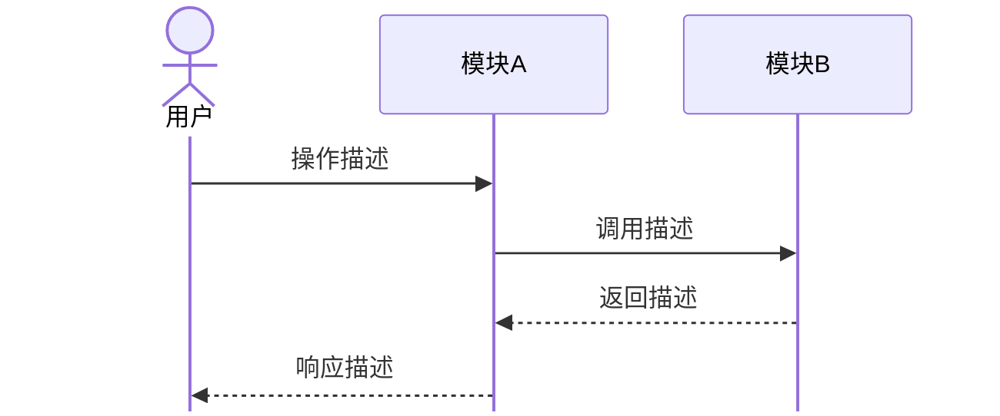

# Codex Agent Instructions: thesis-to-markdown

> **Codex agents**: read this file.
> **Claude Code users**: see `.claude/skills/thesis-to-markdown.md` (identical content with YAML frontmatter).
> **Maintainers**: this file and `.claude/skills/thesis-to-markdown.md` are a sync pair — change one, change both.

把任意原始输入转成 `input/<slug>.md`——一份**严格符合 `thesis2docx.py` 自定义解析器规范**的 SSPU 本科毕业论文 Markdown 源文件。

> ⚠️ 本项目的 Markdown 解析器**不是通用引擎**。语法细节见下方「解析器语法速查」。写错会被忽略或产生错误排版。**不要凭直觉写 Markdown，按速查表来。**

## 工作流（7 步，严格按序）

### Step 1 — 识别意图

读用户消息，归到下面四类之一。**模糊时先问一句确认，不要猜。**

| 类别 | 信号 | 示例 |
|---|---|---|
| A. 从零起草 | 给题目/方向，没现成文本 | "帮我写一篇关于 X 的毕业论文" |
| B. 粘贴草稿 | 对话里贴了一大段文字 | （直接贴内容）"帮我整理成论文格式" |
| C. 文件转换 | 提供 .docx / .pdf / .txt 路径 | "把 ~/Downloads/draft.docx 转一下" |
| D. 修改已有 md | 指明 input/*.md + 改动点 | "把 input/thesis.md 第三章表格改规范" |

### Step 2 — 获取原始内容

- **A**: 询问用户：题目、专业、大致章节骨架（至少 4 章）、研究背景一句话概述。然后基于这些信息**起草全文结构**（不要等用户写）。
- **B**: 直接读粘贴文本。
- **C**: 用 shell 提取：
  - `.docx` → `pandoc -f docx -t plain "<path>" 2>/dev/null || unzip -p "<path>" word/document.xml | sed 's/<[^>]*>//g'`
  - `.pdf` → `pdftotext -layout "<path>" -`
  - `.txt` → 直接读取
  - 提取后告知用户："已从 <file> 提取文本，请人工校对后再继续。"
- **D**: 读取目标 md 文件。

### Step 3 — 抽取封面 10 字段

能从原文抓就抓，抓不到就**一次性向用户询问所有缺失项**（不要分多次问）。

| # | 字段 | 必填 | 备注 |
|---|---|---|---|
| 1 | 题目 | ✅ | 中文 |
| 2 | 英文题目 | ✅ | **全大写**，如 `DESIGN AND IMPLEMENTATION OF ...` |
| 3 | 学号 | ✅ | 数字 |
| 4 | 姓名 | ✅ | |
| 5 | 班级 | ✅ | |
| 6 | 专业 | ✅ | |
| 7 | 学部(院) | ✅ | |
| 8 | 入学时间 | ✅ | 格式 `XXXX级` |
| 9 | 指导教师 | ✅ | |
| 10 | 日期 | ✅ | 格式 `XXXX年XX月XX日` |

⚠️ **隐私提醒**：在询问前告知用户"学号、姓名等个人信息将写入本地 md 文件，请确认是否继续"。

### Step 4 — 拆分文档结构

按以下顺序组装（每节之间插入 `<div style="page-break-after: always;"></div>`）：

```
<div align="center">
# 本科毕业设计（论文）
[封面表格]
</div>

--- (page-break div)

## 毕业设计（论文）独创性声明
[固定文本，照抄 input/thesis.md 范文]

--- (page-break div)

<div align="center">
# [中文题目]
</div>

## 摘要
[中文摘要正文，2-3 段]

**关键词：** 关键词1；关键词2；关键词3；关键词4；关键词5

## ABSTRACT
[English abstract, 2-3 paragraphs]

**Keywords:** keyword1; keyword2; keyword3; keyword4; keyword5

--- (page-break div)

# 1 [第一章标题]
...

# 2 [第二章标题]
...

--- (page-break div)

## 参考文献
[GB/T 7714 格式条目]

--- (page-break div)

## 致谢
[致谢正文]
```

### Step 5 — 语法规范化（核心！）

**逐条检查**，不符合就重写。详见下方「解析器语法速查」。落盘前过一遍自检清单：

- [ ] 封面 10 字段齐备，英文题目全大写
- [ ] 封面表格用 `<div align="center">` 包裹
- [ ] 所有表格有 `<div align="center">` + 粗体表题 `**表x-x 表题**`
- [ ] 所有独立公式用 `$$...$$` + `\tag{x-x}`，行内公式用 `$...$`
- [ ] 图片路径以 `images/` 开头、文件名符合 `图x-x-描述.png` 规范且文件存在（缺失则用 `<!-- TODO -->` 占位并汇总告知用户）
- [ ] 正文中的数学变量/公式均已用 `$...$` 或 `$$...$$` 包裹，无裸露数学符号
- [ ] 图题用 `**图x-x 图题**`，居中
- [ ] 章节间有 `<div style="page-break-after: always;"></div>`
- [ ] 全文标点为中文全角（代码块和公式内部除外）
- [ ] H1/H2/H3 后均有空格，仅用到 H3
- [ ] 中英文摘要分离，各有标题 + 关键词行
- [ ] 无 Mermaid / 脚注 / 嵌套列表等不支持语法

### Step 6 — 落盘

- 文件名：`input/<slug>.md`，slug 由题目拼音或用户指定生成（小写短横线分隔）
- **避开** `input/thesis.md`（保留作范文）
- 写入文件
- 写入后重读验证无截断

### Step 7 — 询问润色 + 提示命令

1. 询问用户："是否需要去除 AI 痕迹（调用 humanizer-academic-zh）？"
   - Yes → 读取 `.claude/skills/humanizer-academic-zh.md` 按其指令处理 `input/<slug>.md`
   - No → 跳过
2. 最后输出固定文案：

```
✅ 已生成 input/<slug>.md

运行以下命令生成 Word 文档：

    uv run python thesis2docx.py

输出位置：output/ 目录
```

---

## 解析器语法速查

> 来源：CLAUDE.md + thesis2docx.py parse_markdown()。**这是唯一可信源**，不要套用 GitHub Flavored Markdown 习惯。

### 标题

```markdown
# 1 绪论              ← H1 = 章，居中黑体 16pt
## 1.1 研究背景        ← H2 = 节，左对齐黑体 14pt
### 1.1.1 国内现状     ← H3 = 小节，黑体 12pt
```

- `#` 后**必须有空格**
- 仅支持 H1-H3，H4+ 被当作普通段落
- 每章以 H1 开头

### 行内格式

```markdown
**加粗**  *斜体*  ***加粗斜体***  `行内代码`
```

### 表格（⚠️ 特殊）

```markdown
<div align="center">

**表2-1 系统功能模块**

| 模块 | 功能描述 | 技术实现 |
|:-----|:---------|:---------|
| 用户管理 | 注册登录 | JWT |
| 宠物交互 | 对话养成 | LLM API |

</div>
```

- 必须 `<div align="center">` 包裹
- 表题必须是 `**表x-x 表题**`，在表格上方
- div 与表格之间留空行

### 公式（⚠️ 特殊）

独立公式（带编号）：
```markdown
$$
E = mc^2 \tag{2-1}
$$
```

独立公式（不带编号）：
```markdown
$$
\int_0^\infty e^{-x} dx = 1
$$
```

行内公式：`$E = mc^2$`

- 编号格式 `\tag{x-x}`，x-x = 章-序号
- `$$` 独占一行，公式体另起一行

### 图片

```markdown

```

- 路径**相对于项目根目录**，例如 `images/图3-1-系统架构图.png`
- 解析器已支持本地文件回退：相对路径 / `file://` URI / http(s) URL 均可
- 文件必须存在，否则 docx 生成时图片缺失并打印警告
- 图题自动取 alt 文本，格式 `图x-x`

### 图片工作流（⚠️ 必读）

#### 命名规范

所有图片以**图注命名**，放 `images/` 目录：

```
images/图1-1-研究框架.png
images/图2-1-情绪状态机.png
images/图3-1-用户交互时序.png
images/图4-1-交互趋势.png
```

当用户提供图片或要求引用图片时，先确认文件名符合此规范。不符合则建议重命名。

#### AI 生成图表的风格约束

当用户需要 AI 帮忙画图时，**严格遵守以下风格基准**（与论文整体一致）：

| 维度     | 规范                                                  |
| -------- | ----------------------------------------------------- |
| 配色     | **纯黑白灰**。线条 #000000，填充白色或浅灰 #F5F5F5，禁止彩色 |
| 字体     | 中文用 SimHei/黑体，英文用 Times New Roman，14px 基准 |
| 线宽     | 1-1.5px，统一实线，避免虚线/点线                      |
| 背景     | 纯白 #FFFFFF                                          |
| 输出     | PNG，DPI ≥ 300，宽度 ≥ 2000px                         |

**图表类型优先级：**

1. **时序图**（首选）→ 用 Mermaid 渲染为 PNG，theme=default + 黑白 themeVariables
2. **流程图/架构图** → graphviz dot 或 matplotlib，黑白框线
3. **数据图**（柱状/折线/散点）→ matplotlib，见下方交互规则
4. **ER图/数据库图** → graphviz，黑白矩形+连线
5. ❌ 禁止：饼图、3D图、渐变、阴影、emoji图标

**Mermaid 时序图模板（直接套用）：**

````markdown

````

> ⚠️ Mermaid 代码块本身不会被解析器渲染进 docx。生成后需用 `mmdc` CLI 导出为 PNG，再在 md 中用 `` 引用。
>
> **mmdc 不可用时的降级策略**：若 `mmdc` 未安装或报 `Could not find Chrome`，**自动改用 matplotlib 手绘时序图**（参考「AI 生成图表的风格约束」中的配色规范）。不要因此中断流程。修复 mmdc 的命令：`npx puppeteer browsers install chrome-headless-shell`

#### 架构图结构化提问

当用户说"帮我画个架构图/系统图/流程图"但描述模糊时，**用以下模板追问**（不要猜）：

```text
请描述你的架构图：
1. 分几层？每层名称是什么？
2. 每层包含哪些组件？（列举即可）
3. 层与层之间数据流向？（上→下 / 双向 / 环形 / ...）
4. 有没有外部系统/API 需要画出？
```

拿到回答后用 matplotlib 绘制（graphviz dot 亦可，前提是 `dot` 已安装）。

#### 数据图交互规则

当原文包含数值数据（表格、统计结果、实验指标）时：

1. **按数据类型默认推荐**（减少用户选择负担）：
   - 时间序列 → 折线图
   - 分类对比 → 柱状图
   - 矩阵/交叉表 → 热力图（灰度）
   - 占比构成 → 堆叠柱状图（❌ 不用饼图）
   - 不确定 → 询问用户
2. **主动告知**："检测到表x-x包含N组数据，建议生成[推荐类型]，是否同意？也可选其他类型或跳过"
3. 用户同意后，运行 matplotlib 脚本，**严格使用上述黑白风格**：
   ```python
   import matplotlib.pyplot as plt
   plt.rcParams['font.sans-serif'] = ['SimHei', 'Arial Unicode MS']
   plt.rcParams['axes.unicode_minus'] = False
   fig, ax = plt.subplots(figsize=(10, 6), dpi=300)
   # 颜色只用 '#000000', '#666666', '#AAAAAA', '#F5F5F5'
   ax.bar(..., color='#000000', edgecolor='#000000')
   ax.spines[:].set_color('#000000')
   plt.savefig('images/图x-x-xxx.png', bbox_inches='tight', facecolor='white')
   ```
3. 生成后自动写入 md 引用，无需用户手动操作

#### 用户提供图片的流程

1. 用户说"这张图放在第三章"或直接拖文件到终端
2. **若图片还在手机上**，先引导传输：
   ```text
   📱 手机图片传输方式（任选其一）：
   • AirDrop / 微信文件助手 → 保存到 images/
   • iCloud / Google Photos → 电脑下载 → cp 到 images/
   • USB 数据线直传
   传完后告诉我文件名，我帮你重命名并插入 md。
   ```
3. 确认文件已在 `images/` 下，若不在则 `cp/mv` 过去
4. 按图注重命名：`images/图3-x-描述.png`
5. 在 md 对应位置插入 ``
6. **若用户暂时无法提供图片**，在 md 中插入占位注释 `<!-- TODO: 补充图3-x xxx截图 -->`，并在落盘后汇总所有待补图片清单告知用户

### 分页

```markdown
<div style="page-break-after: always;"></div>
```

用于：封面后、声明后、摘要后、每章之间、参考文献前、致谢前。

### 标点

全文使用中文全角标点：`，。；：！？（）【】""''`
代码块和公式内部可用半角。

### 不支持的语法（遇到要告知用户）

- ❌ Mermaid 图表
- ❌ 脚注 `[^1]`
- ❌ 嵌套列表超过 2 层
- ❌ HTML 标签（除上述 div 外）
- ❌ 引用块 `>`（会被转为普通段落）
- ❌ 任务列表 `- [ ]`

---

## 边界与注意事项

1. **不扩展解析器**：若用户需求超出当前解析器能力（如 mermaid、复杂表格），明确告知"当前解析器不支持 X，建议 Y 替代"，不要硬塞。
2. **文件提取需校对**：pandoc/pdftotext 提取可能有噪声，始终提醒用户人工校对。
3. **字段隐私**：Step 3 询问前必提醒。
4. **不改 thesis2docx.py**：本 skill 只生成合规输入，不动转换器代码。
5. **双平台同步**：本文件内容与 `.claude/skills/thesis-to-markdown.md` 逐字同步。改一处必改另一处。
6. **范文参考**：`input/thesis.md` 是合规范例，不确定时读取它对照。
