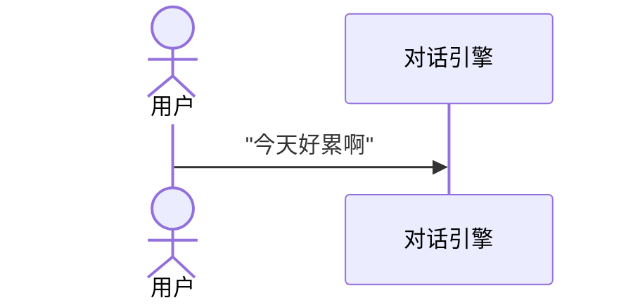

# SSPU 毕业论文 Markdown → Word 格式生成工具

将 Markdown 撰写的本科毕业论文自动转换为符合**上海第二工业大学（SSPU）2026届**模板规范的 `.docx` 文件。

> 告别手动调格式，专注论文内容本身。

## ✨ 功能特性

- **一键生成**：Markdown → 标准格式 Word 文档，封面、摘要、目录、正文全自动排版
- **公式渲染**：LaTeX 公式通过 XeLaTeX 编译为高清 PNG（1200 DPI），支持编号公式右对齐
- **图表嵌入**：本地图片直接嵌入，网络图片自动下载
- **样式映射**：严格对照学校模板的字体、字号、行距、缩进等排版要求
- **目录生成**：基于 PAGEREF 域的自动目录，Word 打开后按提示更新即可显示页码
- **零依赖 Word**：纯 Python + OpenXML 操作，无需安装 Microsoft Office

## 📋 环境要求

| 依赖               | 说明                                                  |
| ------------------ | ----------------------------------------------------- |
| Python ≥ 3.10      | 运行环境                                              |
| uv                 | Python 包管理器 (<https://docs.astral.sh/uv/>)        |
| XeLaTeX (TeX Live) | 公式渲染（可选，缺失时公式以原始 LaTeX 文本显示）     |
| macOS / Linux      | 开发平台                                              |

## 🚀 快速开始

### 1. 安装依赖

使用 uv（推荐）：

```bash
uv sync
```

或使用 pip：

```bash
pip install -r requirements.txt
```

如需公式渲染，确保已安装 TeX Live：

```bash
# macOS
brew install --cask mactex

# Ubuntu/Debian
sudo apt install texlive-xetex texlive-fonts-recommended texlive-lang-chinese

# 验证
xelatex --version
```

### 2. 准备论文

在 `input/thesis.md` 中用 Markdown 撰写论文，图片放在 `images/` 目录下。

#### Markdown 语法规范

本工具使用自定义解析器（非通用 Markdown 引擎），请严格遵守以下语法。不符合规范的写法可能被忽略或产生错误排版。

##### 标题

```text
# 一级标题       → 章标题（居中，黑体 16pt）
## 二级标题      → 节标题（左对齐，黑体 14pt）
### 三级标题     → 小节标题（黑体 12pt）
```

- `#` 后**必须有一个空格**：`# 绪论` ✅ / `#绪论` ❌
- 仅支持 H1–H3；H4 及以下会被当作普通段落
- 每章以 H1 开头，如 `# 1 绪论`、`# 2 系统设计`
- 标题独占一行，前后各留一个空行

##### 行内格式

```text
**加粗**    *斜体*    ***加粗斜体***    `行内代码`
```

- 标记与被修饰文字之间**不能有空格**：`**重要**` ✅ / `** 重要 **` ❌
- 不支持 ~~删除线~~、下划线、超链接、脚注等扩展语法
- 行内公式 `$...$` 视为特殊行内元素（见下方公式章节）

##### 段落

- 段落之间用**一个空行**分隔
- 同一逻辑段落的连续多行会自动合并，换行不会分段
- 首行自动缩进两字符，**不要手动添加空格或全角空白**
- 如需强制分段，插入空行即可

##### 列表

```text
- 无序列表项          ← 用 - 或 * 开头
* 也可以这样

1. 有序列表项         ← 数字 + 英文点 + 空格
2. 第二项

（1）中文编号列表     ← 全角括号
(2) 半角括号也可以
```

- 列表符号后**必须有空格**：`- 内容` ✅ / `-内容` ❌
- 不支持嵌套列表（子列表会被当作独立顶层列表）
- 中文编号 `（N）` / `(N)` 作为普通段落处理，保留原始编号文本
- 有序列表 `N.` 保留原始编号，不会自动重排

##### 表格与表题

表题格式（必须严格遵循三行结构）：

```text
<div align="center">

**表1-1 现有桌面伴侣产品对比**

</div>
```

- `<div align="center">` 和 `</div>` 各占一行
- 表题 `**表X-X ...**` 独占中间一行，前后各留一个空行
- 表题必须用 `**` 加粗包裹

表格本体紧跟表题之后：

```text
| 列1 | 列2 | 列3 |
|:----|:----|:----|
| 内容 | 内容 | 内容 |
```

- 表头下方**必须有分隔行**（含 `-` 的行），否则不识别为表格
- 单元格内可使用 `**加粗**` 等行内格式
- 不支持合并单元格、跨行跨列

##### 图片与图题

```text

```

- 图片语法必须**独占一整行**，行内嵌入不会被识别
- `[]` 内的 alt 文本自动作为图题，显示在图片下方并居中
- 路径相对于 `input/thesis.md` 所在目录（如 `../images/xxx.png`）
- 支持本地文件和 HTTP/HTTPS 网络图片（网络图片自动下载）
- 图题命名建议遵循 `图X-X 描述` 格式

##### 公式

行内公式：

```text
其中 $x$ 为周数，$y$ 为日均交互次数。
```

块级公式（`$$` 各占一行）：

```text
$$
y = 2.47x + 1.93, \quad R^2 = 0.987 \tag{4-1}
$$
```

- 块级公式的开闭 `$$` 必须**各自独占一行**
- 编号用 `\tag{X-X}` 写在公式末尾、`$$` 之前，生成右对齐编号
- 无 `\tag` 的块级公式居中显示
- 需要系统安装 XeLaTeX；未安装时公式以原始 LaTeX 文本回退显示
- 行内 `$...$` 与正文之间可有空格，不影响解析

##### 代码块

````text
```python
def hello():
    print("world")
```
````

- 代码块转换为 Word 表格样式展示，带语言标签
- 代码块前的最近一段文字会自动关联为代码说明
- 也可用 HTML 注释显式指定说明：`<!-- 代码描述: 情感分析核心逻辑 -->`
- 围栏标记 `` ``` `` 后可跟语言名（如 `python`、`javascript`），用于标签显示

##### Mermaid 图表

````text


图3-1 用户交互时序图
````

- 使用 `` ```mermaid `` 围栏标记
- 图表结束后紧跟 `图X-X 描述` 行作为图注（可选）
- 渲染为 PNG 嵌入文档

##### 引用块

```text
> 这是一段引用文字
> 可以多行，每行以 > 开头
```

- 每行必须以 `>` 开头，`>` 后有空格
- 多行引用自动合并为一个段落
- 样式为居中楷体，适用于名言、定义等

##### 会被忽略的内容

以下内容在转换时**直接跳过**，不会出现在生成的 Word 中：

- `---` 水平分隔线
- `<div>` / `</div>` 标签本身（仅用于表题居中的容器作用）
- 空行

##### 完整示例片段

```text
## 2.1 整体架构

系统采用前后端分离架构，前端基于 Electron 实现桌面端。

<div align="center">

**表2-1 模块职责划分**

</div>

| 模块 | 技术栈 | 职责 |
|:-----|:-------|:-----|
| 桌面端 | Electron + Live2D | 角色渲染与交互 |
| 对话引擎 | Python + LLM API | 语义理解与回复生成 |

情绪状态转移概率公式如下：

$$
P(S_{t+1} | S_t, E_t) = \sigma(W_s \cdot h(S_t) + W_e \cdot g(E_t)) \tag{2-1}
$$


```

### 3. 生成文档

```bash
uv run python thesis2docx.py
```

输出文件位于 `output/` 目录。**首次用 Word/WPS 打开时，选择"更新域"以生成目录页码。**

## 📁 项目结构

```text
graduation_project_SSPU/
├── thesis2docx.py          # 核心转换脚本
├── input/
│   └── thesis.md           # 论文 Markdown 源文件
├── images/                 # 论文插图
├── template/               # SSPU 2026届 Word 模板（OpenXML 解压结构）
│   ├── word/
│   │   ├── document.xml    # 模板正文 XML
│   │   ├── styles.xml      # 样式定义
│   │   └── media/          # 模板原始资源 + 运行时生成的公式/图片
│   └── ...                 # 其他 OpenXML 组件
├── output/                 # 生成的 .docx 文件（gitignored）
├── pyproject.toml          # uv 项目配置
└── CLAUDE.md               # AI 辅助开发上下文
```

## ⚙️ 工作原理

本工具直接操作 `.docx` 内部的 OpenXML 结构（ZIP 内的 XML 文件），不依赖任何 Office 套件：

```text
input/thesis.md
       │
       ▼
  parse_markdown()        ← 解析为结构化块
       │
       ▼
  inject_cover_data()     ← 填充封面字段
       │
       ▼
  replace_abstracts()     ← 注入中英文摘要
       │
       ▼
  build_toc_entries()     ← 生成目录域代码
       │
       ▼
  build_body_paragraphs() ← 正文内容 → Word 段落
       │
       ▼
  _update_rels_file()     ← 注册图片/公式关系
       │
       ▼
  ZIP assembly            → output/*.docx
```

**公式渲染管线：** LaTeX → XeLaTeX 编译为 PDF → PyMuPDF 转 1200 DPI PNG → 嵌入 Word

## 🎓 适配说明

本项目基于 **SSPU 2026届本科毕业论文模板** 开发。如果你的学校或年份模板不同，需要：

1. 将新模板 `.docx` 解压到 `template/` 目录
2. 根据 `CLAUDE.md` 中的段落位置映射表重新标定各区域索引
3. 调整 `thesis2docx.py` 中的样式 ID 和字体参数

## 📄 License

MIT
