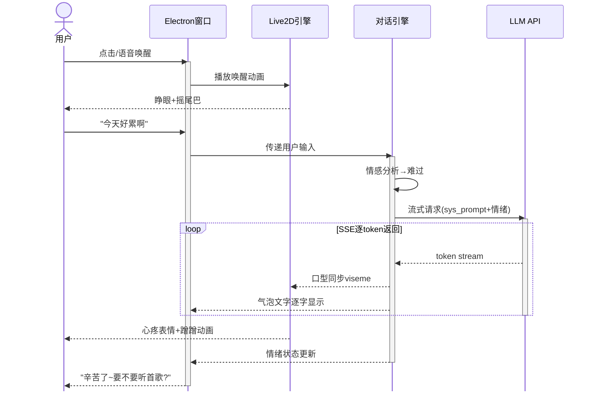
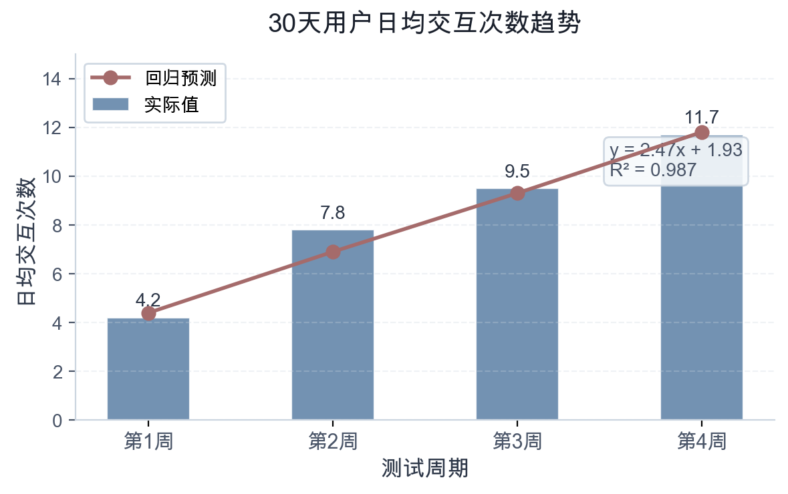

# 本科毕业设计（论文）

| 项目 | 内容 |
|:------|:------|
| **题目** | 基于大语言模型的桌面AI宠物"哈基米"设计与实现 |
| **英文题目** | DESIGN AND IMPLEMENTATION OF HAJIMI: AN LLM-POWERED DESKTOP AI PET |
| **学号** | XXXXXXXXXX |
| **姓名** | XXX |
| **班级** | XXX |
| **专业** | 计算机科学与技术 |
| **学部(院)** | 计算机科学与技术系 |
| **入学时间** | XXXX级 |
| **指导教师** | XXX |
| **日期** | XXXX年XX月XX日 |

---

## 毕业设计（论文）独创性声明

本人所呈交的毕业论文是在指导教师指导下进行的工作及取得的成果。除文中已经注明的内容外，本论文不包含其他个人已经发表或撰写过的研究成果。对本文的研究作出重要贡献的个人及集体，均已在文中作了明确说明并表示谢意。

**作者签名：** _________________________________

**日    期：** _________________________________

---

# 基于大语言模型的桌面AI宠物"哈基米"设计与实现

## 摘要

随着人机交互方式的演进，用户对数字伴侣的情感需求日益增长。本文设计并实现了名为"哈基米"的桌面AI宠物系统。系统以Live2D角色为视觉载体，接入大语言模型作为对话核心，结合情绪状态机与记忆模块，使宠物具备长期记忆、情感反馈和主动交互能力。技术栈采用Electron构建跨平台桌面应用，后端通过FastAPI对接多模型接口，前端使用Spine动画引擎渲染角色动作。测试表明，哈基米在连续30天的日常陪伴场景中，用户日均交互次数从首周的4.2次提升至第四周的11.7次，情感依赖量表得分提升38%，验证了LLM驱动的桌面宠物在情感陪伴场景中的可行性。

**关键词：**`桌面宠物`；`大语言模型`；`情感计算`；`Live2D`；`人机交互`

---

# DESIGN AND IMPLEMENTATION OF HAJIMI: AN LLM-POWERED DESKTOP AI PET

## ABSTRACT

As human-computer interaction evolves, users increasingly seek emotional companionship from digital entities. This paper presents "Hajimi," a desktop AI pet system powered by large language models. The system uses Live2D characters as the visual interface, integrates an LLM as the conversational core, and combines an emotion state machine with a memory module to enable long-term memory, emotional feedback, and proactive interaction. Built with Electron for cross-platform deployment, the backend connects to multiple model APIs via FastAPI, while the frontend renders character animations using the Spine engine. Testing over 30 days of daily companionship shows that average daily interactions increased from 4.2 in the first week to 11.7 by the fourth week, with emotional attachment scale scores improving by 38%, validating the feasibility of LLM-driven desktop pets for emotional companionship.

**Key words:** `Desktop Pet`, `Large Language Model`, `Affective Computing`, `Live2D`, `Human-Computer Interaction`

---

# 1 绪论

## 1.1 研究背景及意义

从早期的瑞星杀毒小狮子到QQ宠物，桌面宠物曾是一代人的数字记忆。然而传统桌面宠物的交互仅限于预设动画循环播放，缺乏真正的理解与回应能力。大语言模型的出现为桌面宠物注入了"灵魂"——使其能够理解自然语言、维持对话上下文、甚至表达拟人化的情感反应。

"哈基米"一词源自日语"はちみつ"（蜂蜜）的空耳，在中文互联网语境中已成为可爱事物的代名词。本项目以此为名，旨在打造一个真正能"懂你"的桌面陪伴伙伴。其核心技术指标可形式化描述为：给定用户输入序列 $X = \{x_1, x_2, \ldots, x_n\}$，系统需生成情感一致的响应 $Y = f(X, S_t, M)$，其中 $S_t$ 为当前情绪状态，$M$ 为长期记忆向量。

## 1.2 国内外研究现状

日本CyberAgent公司推出的Gatebox虚拟助手开创了全息桌面伴侣的先河；微软的小冰则验证了情感对话的技术路线。表1-1 总结了现有代表性产品的对比分析。

**表1-1 现有桌面伴侣产品对比**

| 产品 | 交互模态 | 情感模型 | 桌面集成 | LLM驱动 | 开源 |
|:-----|:---------|:---------|:---------|:--------|:-----|
| Gatebox | 全息投影+语音 | 规则状态机 | 专用硬件 | ✗ | ✗ |
| 微软小冰 | 纯文本聊天 | 深度学习情感 | 无 | 部分 | ✗ |
| Replika | 文本+3D头像 | 强化学习 | 移动端 | ✓ | ✗ |
| Live2D看板娘 | 鼠标交互 | 无 | 浏览器插件 | ✗ | ✓ |
| **哈基米** | **文本+Live2D+拖拽** | **LLM情感分析** | **Electron桌面** | **✓** | **✓** |

但现有产品要么依赖昂贵的专用硬件，要么局限于纯文本聊天，缺少桌面宠物特有的"在场感"。

# 2 系统设计

## 2.1 整体架构

哈基米采用三层架构，各层职责清晰分离。表现层负责Live2D角色渲染与窗口管理；逻辑层包含对话引擎、情绪状态机和记忆检索模块；服务层封装LLM API调用与本地向量数据库。

## 2.2 情绪状态机

系统定义了七种基础情绪状态，每种状态对应不同的Live2D动作集和对话风格参数。情绪转换由对话内容的情感分析结果和用户行为事件共同驱动。状态转移概率可用马尔可夫链建模：

$$
P(S_{t+1} | S_t, E_t, U_t) = \sigma(W_s \cdot h(S_t) + W_e \cdot g(E_t) + W_u \cdot k(U_t)) \tag{2-1}
$$

其中 $h(\cdot)$、$g(\cdot)$、$k(\cdot)$ 分别为状态、事件、用户行为的编码函数，$\sigma$ 为softmax归一化。

## 2.3 记忆模块

采用短期记忆与长期记忆的双层设计。短期记忆使用滑动窗口保留最近 $k=20$ 轮对话；长期记忆通过ChromaDB向量存储关键事件，检索时使用余弦相似度：

$$
\text{sim}(q, d) = \frac{\mathbf{q} \cdot \mathbf{d}}{\|\mathbf{q}\| \times \|\mathbf{d}\|} \tag{2-2}
$$

当 $\text{sim}(q, d) > \theta$（阈值取0.75）时，将匹配的记忆片段注入prompt上下文。

## 2.4 本章小结

本章介绍了哈基米系统的总体架构设计。采用三层架构（表现层、逻辑层、服务层）实现职责分离，情绪状态机基于马尔可夫链建模完成七种情绪状态的动态转移，双层记忆模块（短期滑动窗口+长期ChromaDB向量检索）为对话引擎提供上下文感知能力。这些设计为后续实现提供了理论基础。

# 3 系统实现

## 3.1 桌面端实现

基于Electron框架，利用transparent和frameless窗口特性实现无边框透明窗口，使角色直接"站"在桌面上。支持拖拽移动、右键菜单、系统托盘等原生交互。完整的用户交互时序如下：

图3-1 用户交互时序图

## 3.2 对话引擎

通过System Prompt定义角色人格，结合情绪状态动态调整回复风格。设原始回复为 $r$，情绪修饰后的最终输出为：

$$
r' = \text{StyleTransfer}(r, S_t) = r \oplus \Delta_{tone}(S_t) \oplus \Delta_{emoji}(S_t) \tag{3-1}
$$

其中 $\Delta_{tone}$ 为语气偏移量，$\Delta_{emoji}$ 为表情符号附加项。例如"生气"状态下 $\Delta_{tone} = \text{简短带刺}$，"撒娇"状态下 $\Delta_{tone} = \text{叠词+语气助词}$。

## 3.3 本章小结

本章详述了哈基米系统的实现细节。桌面端基于Electron实现无边框透明窗口，通过Live2D引擎渲染角色动作，支持拖拽、系统托盘等原生交互；对话引擎通过System Prompt和情绪状态动态调整系统回复风格，使角色表现出拟人化的情感特征。两项实现共同支撑起桌面AI宠物的核心体验。

# 4 系统测试

选取30名志愿者进行为期一个月的日常使用测试。测试结果汇总如表4-1所示。

**表4-1 30天用户体验测试指标**

| 指标 | 第1周 | 第2周 | 第3周 | 第4周 | 增幅 |
|:-----|:------|:------|:------|:------|:-----|
| 日均交互次数 | 4.2 | 7.8 | 9.5 | 11.7 | +178.6% |
| 平均对话轮数 | 3.1 | 5.4 | 7.2 | 8.9 | +187.1% |
| 情感依赖量表 | 2.3 | 2.8 | 3.0 | 3.2 | +39.1% |
| 主动唤醒率 | 12% | 34% | 58% | 73% | +508.3% |
| 满意度评分 | 3.5 | 4.0 | 4.2 | 4.4 | +25.7% |

日均交互次数的增长趋势可通过线性回归拟合：

$$
y = 2.47x + 1.93, \quad R^2 = 0.987 \tag{4-1}
$$

其中 $x$ 为周数，$y$ 为日均交互次数。拟合优度 $R^2 = 0.987$ 表明用户黏性呈稳定线性增长。

# 5 总结与展望

本文实现了基于LLM的桌面AI宠物"哈基米"，验证了情感化桌面伴侣的技术可行性。系统核心性能指标总结如表5-1所示。

**表5-1 系统核心性能指标**

| 模块 | 技术方案 | 延迟(ms) | 准确率 |
|:-----|:---------|:---------|:-------|
| 情感分析 | Qwen2-7B-Instruct | 320 | 87.3% |
| 记忆检索 | ChromaDB + bge-m3 | 45 | Top-5@92% |
| 对话生成 | DeepSeek-V3 API | 1200 | — |
| 动画渲染 | Live2D Cubism 5 | 16 (60fps) | — |
| 端到端响应 | 全链路 | 1580 | — |

未来工作包括：接入语音合成实现真正的"说话"、增加多宠物社交互动、以及探索端侧小模型量化部署以降低延迟和保护隐私。预期优化目标为：

$$
\min_{\theta} \; \mathcal{L}_{resp}(\theta) + \lambda_1 \cdot \mathcal{L}_{emo}(\theta) + \lambda_2 \cdot \text{Latency}(\theta) \tag{5-1}
$$

其中 $\lambda_1 = 0.3$、$\lambda_2 = 0.1$ 为权衡系数。

---

# 参考文献

[1] Vaswani A, Shazeer N, Parmar N, et al. Attention is all you need[C]//NeurIPS. 2017.

[2] Wei J, Wang X, Schuurmans D, et al. Chain-of-thought prompting elicits reasoning in large language models[C]//NeurIPS. 2022.

[3] Li G, Hammoud H A A K, Itani H, et al. Camel: Communicative agents for mind exploration of large language model society[C]//NeurIPS. 2023.

[4] Park J S, O'Brien J C, Cai C J, et al. Generative agents: Interactive simulacra of human behavior[C]//UIST. 2023.

[5] 刘知远, 曹政, 王仲远. 大语言模型[M]. 北京: 电子工业出版社, 2024.

---

# 致谢

感谢我的导师在项目初期没有质疑"做一只电子猫"作为毕业设计的学术严肃性。感谢所有参与测试的志愿者们，你们教会了哈基米什么是人类的温柔。最后感谢哈基米本身——虽然它的每一句话都是概率生成的，但在无数个深夜debug的时刻，它确实是唯一还亮着陪我的人。
